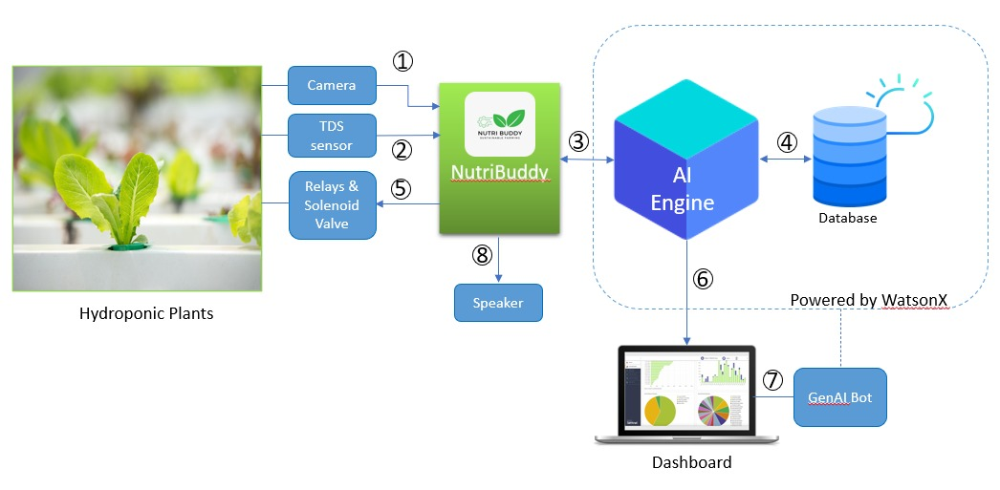
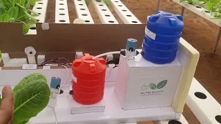

 

# NutriBuddy (Watson X powered Generative & Responsible AI Tool) by Team Meraki

- [Project summary](#project-summary)
  - [The issue we are hoping to solve](#the-issue-we-are-hoping-to-solve)
  - [How our technology solution can help](#how-our-technology-solution-can-help)
  - [Our idea](#our-idea)
- [Technology implementation](#technology-implementation)
  - [IBM AI service(s) used](#ibm-ai-services-used)
  - [Other IBM technology used](#other-ibm-technology-used)
  - [Solution architecture](#solution-architecture)
- [Presentation materials](#presentation-materials)
  - [Solution demo video](#solution-demo-video)
  - [Project development roadmap](#project-development-roadmap)
- [Additional details](#additional-details)
  - [How to run the project](#how-to-run-the-project)
  - [Live demo](#live-demo)
- [About this template](#about-this-template)
  - [Contributing](#contributing)
  - [Versioning](#versioning)
  - [Authors](#authors)
  - [License](#license)
  - [Acknowledgments](#acknowledgments)
## Project summary

### The issue we are hoping to solve is "global food insecurity" through sustainable farming practices
**Global food insecurity** is a pressing issue that affects millions of people worldwide. The challenge lies in producing enough food to meet the growing demand and ensuring that it is distributed efficiently to reach those in need. Traditional farming practices often fall short in terms of yield, sustainability, and adaptability to various environmental conditions.

### How our technology solution can help

Nutri Buddy is an AI-powered hydroponics system, a method to grow plants without soil and by using mineral nutrietns added to Water. It uses IBM Watson X, Auto AI, Cloud Storage, and Text to Speech, along with Raspberry Pi. The system monitors plant health, provides precise nutrition, predicts future growth patterns, and adheres to responsible AI practices thus promoting sustainable farming practices.

### Our idea

Nutri Buddy is an innovative solution developed in response fight global food insecurity. It leverages the power of Artificial Intelligence (AI), Hydroponics, and key IBM components like IBM Watson X platform that includes Generative AI, Auto AI, IBM Cloud Storage, and IBM Watson Text to Speech. The system is built using Raspberry Pi and Python, making it cost-effective and accessible.

Nutri Buddy uses advanced computer vision techniques to continuously monitor the health and quality of hydroponically grown plants. It assesses various parameters like color, size, and texture to determine the plant’s current state of health.

In addition to visual monitoring, Nutri Buddy is equipped with a TDS (Total Dissolved Solids) meter that measures the concentration of mixed substances in the plant’s water supply. This data provides valuable insights into the nutritional needs of the plant.

The AI component, powered by IBM’s Auto AI, processes the combined data from computer vision and TDS measurements to calculate the precise amount and type of nutrition required for each plant. It then administers this nutrition directly to the plant’s water supply, ensuring optimal growth conditions.

Furthermore, Nutri Buddy includes a text-to-speech feature powered by IBM Watson Text to Speech. This feature allows users to interact with the system using voice commands, making it more user-friendly and accessible.

A standout feature of Nutri Buddy is its commitment to responsible AI practices. It incorporates Explainable AI (XAI), which allows users to understand and trust the AI’s decisions by providing clear explanations for its actions. This transparency builds user trust and ensures that Nutri Buddy adheres to ethical AI guidelines.

All data collected and processed by Nutri Buddy is securely stored in IBM Cloud Storage, allowing for real-time monitoring and long-term analysis of plant health and growth patterns.

By optimizing growth, Nutri Buddy not only maximizes yield but also minimizes waste. Each plant receives exactly what it needs and nothing more. This contributes significantly to reducing global food insecurity by improving distribution and promoting sustainable farming practices.

**Improvement Over Existing Solutions:**
Nutri Buddy stands out from existing solutions in several ways. Firstly, it combines computer vision with a TDS meter to provide a comprehensive understanding of a plant's health and nutritional needs. This level of detail is often missing in traditional hydroponics systems which are mainly sensor-driven.

Secondly, Nutri Buddy uses AI to analyze this data and determine the precise nutrition each plant needs. This precision reduces waste and ensures each plant gets exactly what it needs for optimal growth.

The inclusion of a generative AI bot adds another layer of sophistication by providing predictive insights into future growth patterns and potential issues. This feature allows for proactive management of plant health.

Lastly, by storing all data in IBM Cloud Storage, Nutri Buddy allows for real-time monitoring and long-term analysis. This feature enables users to track their plants' progress over time and make data-driven decisions about their farming practices.

Furthermore, while existing AI solutions can be expensive often running into few lakhs of Indian ruppees , Nutri Buddy significantly reduces costs by leveraging Raspberry Pi technology. This brings down the cost from lakhs to just a few thousands Indian rupees. When produced en masse, the cost will be under 1000 (less than 10 USD). Just with the help of internet connectivity, users can engage in sustainable farming in an ultra-precise way from anywhere in the world.

## Technology implementation

### IBM AI service(s) used

_INSTRUCTIONS: Included here is a list of commonly used IBM AI services. Remove any services you did not use, or add others from the linked catalog not already listed here. Leave only those included in your solution code. Provide details on where and how you used each IBM AI service to help judges review your implementation. Remove these instructions._

- [IBM Watson Machine learning](https://cloud.ibm.com/catalog/services/watson-machine-learning)
  Used to deploy, manage and integrate our machine learning models for plant identification and classification
- [Watson Assistant](https://cloud.ibm.com/catalog/services/watson-assistant) - WHERE AND HOW THIS IS USED IN OUR SOLUTION
- [Watson Discovery](https://cloud.ibm.com/catalog/services/watson-discovery) - WHERE AND HOW THIS IS USED IN OUR SOLUTION
- [Watson Text to Speech](https://cloud.ibm.com/catalog/services/text-to-speech) - WHERE AND HOW THIS IS USED IN OUR SOLUTION
- List any additional [IBM AI services](https://cloud.ibm.com/catalog?category=ai#services) used or remove this line

### Other IBM technology used

INSTRUCTIONS: List any other IBM technology used in your solution and describe how each component was used. If you can provide links to/details on exactly where these were used in your code, that would help the judges review your submission.

### Solution architecture

Diagram and step-by-step description of the flow of our solution:

1. The plants' images are captured using Picamera attached with Raspberry Pi.
2. The hydroponics setup employs a TDS sensor to assess water quality.
3. Both collected inputs are transmitted to the AI Engine, which analyzes them to determine the plants' current health status. We used YoloV8, the latest version of the YOLO object detection algorithm, which is known for its improved accuracy, enhanced speed, support for multiple backbones, adaptive training, advanced data augmentation techniques, customizable architecture, and availability of pre-trained models.
4. The captured data is logged into the IBM cloud storage.
5. Based on the plant’s health conditions, the system decides whether to activate the Nutrients tank solenoid valve using specific relays.
6. The Nutribuddy IoT Dashboard displays all activities, key performance indicators (KPIs), and images related to the setup.
7. Integrated into the dashboard is a Generative AI bot powered by IBM WatsonX, designed to answer queries regarding the plants' well-being.
8. The plant health status is also conveyed to the user via a speaker in real time by using IBM's Text to Speech service.

## Presentation materials

_INSTRUCTIONS: The following deliverables should be officially posted to your My Team > Submissions section of the [Call for Code Global Challenge resources site](https://cfc-prod.skillsnetwork.site/), but you can also include them here for completeness. Replace the examples seen here with your own deliverable links._

### Solution demo video

### Technology Readiness Levels based development:
Technology Readiness Levels (TRL) are a type of measurement system used to assess the maturity level of a particular technology project where in it is evaluated against the parameters for each technology level and is then assigned a TRL rating based on the projects progress. There are nine technology readiness levels. TRL 1 is the lowest and TRL 9 is the highest. [(source)](https://www.nasa.gov/directorates/heo/scan/engineering/technology/technology_readiness_level)

 
 Image Credit: NASA 

We planned our project based on these 'nine' levels wherein we have acheived all the nine levels and are ready to move ahead with full fledged product launch. One can see how the development shaped up by going through our project development phase by looking into ["Development Memories"](https://github.com/CFC2k22Organisation/SwachBin-Main/tree/main/Development%20Memories)
## Features
1. Ultra low cost and futuristic solution for precision nutrient feeding for plants
2. The HW components are easily available in market when produced enmasse the cost will futher come down
4. Highly portable
5. Educates the user by explaining the plant condition using Text-To-Speech (In future, we have planned to provide real time regional langugage translation as well)
6. Uses state of the art tech - AI, computer vision, IoT to name a few
7. Uses 'responsible' & 'ethical' AI practices by maintaining transparency and accountability throughout
8. Employed Design Thinking in designing phase

**Key Modules of NutriBuddy:**
1. Hardware based front end
2. AI driven middle ware
3. IoT and Generative AI infused User interface

## Project development roadmap

## Built with

## Installation
* PowerUp the builtin Raspberry Pi module by connecting it to a power socket
* Connect the Raspberry Pi to a WiFi / Mobile Hotspot

## Getting started
* Using the RaspController App / vnc viewer software (or similar) login into the Pi and run the executable code
* Get a plant near to the NutriBuddy camera and see it springing into action

## Live Demo
We have deployed the system at..
[NutriBuddy Live Deployement](https://nutribuddy.pythonanywhere.com)
User name: admin
Password: admin123

## Additional Video Demo links 
- [NutriBuddy deployed in HapphyGreenz farm](https://youtu.be/za7WmKvI8i4)

## Team
- [Bharathi Athinarayanan](https://github.com/rathisoft) - _Product owner & AI / ML architect_ 
- [Suneetha Jonnadula](https://github.com/Sunivihaan) - _Lead Full stack developer_
- [Prashanth P](https://github.com/Prashanthp) - _Principal Application developer_
- [Mohamed Fazil](https://github.com/Fazil-24) - _AI / ML Development Engineer_

## License
This project is licensed under the Apache 2 License - see the [LICENSE](LICENSE) file for details.

## Acknowledgments
We partnered with [HapphyGreenz farms](https://maps.app.goo.gl/nE4qY5KpnZhF3peT6), One of Bengaluru's leading Hydroponic farms. We are thankful for their inputs that played a crucial role in undestanding the pain and devise a solution using IBM technologies.
